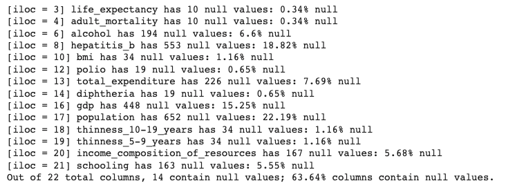
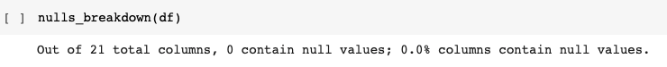
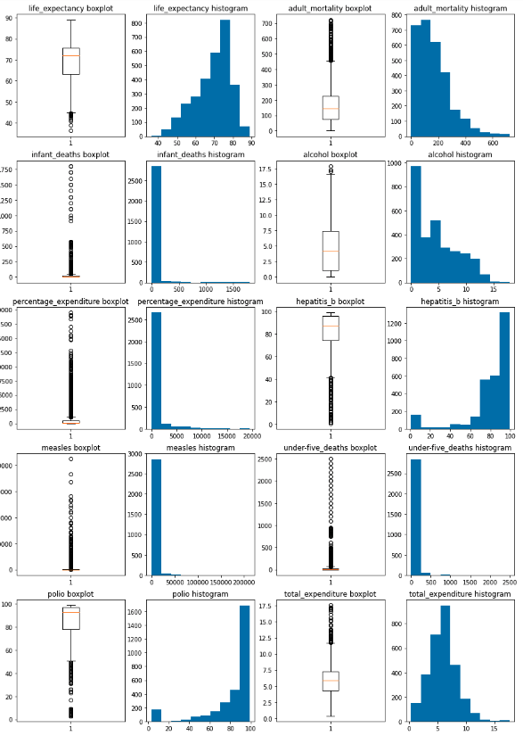
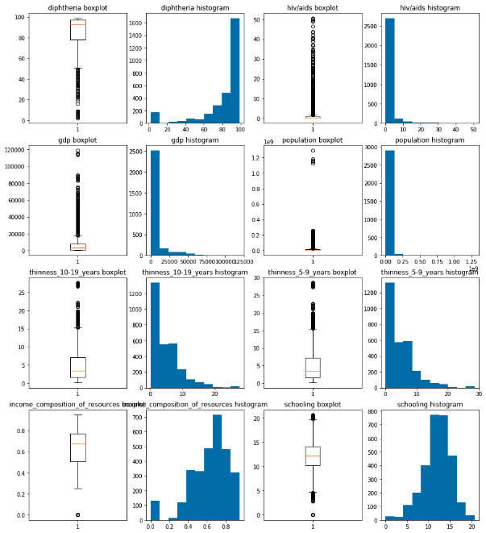
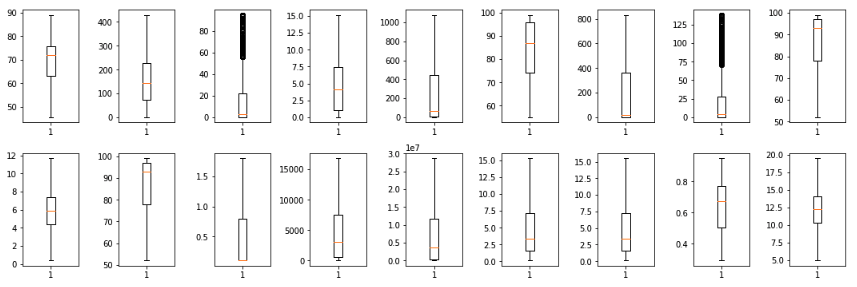
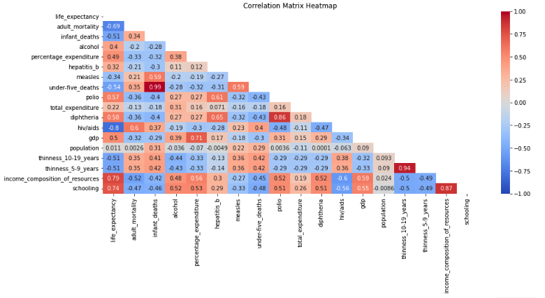
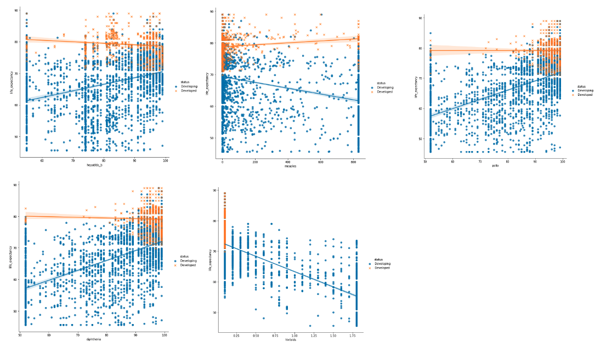
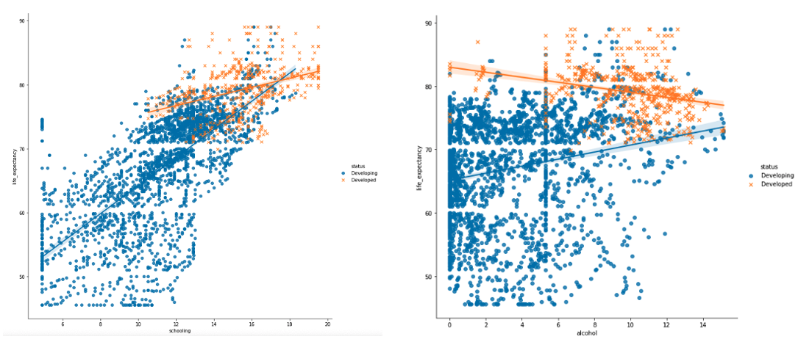
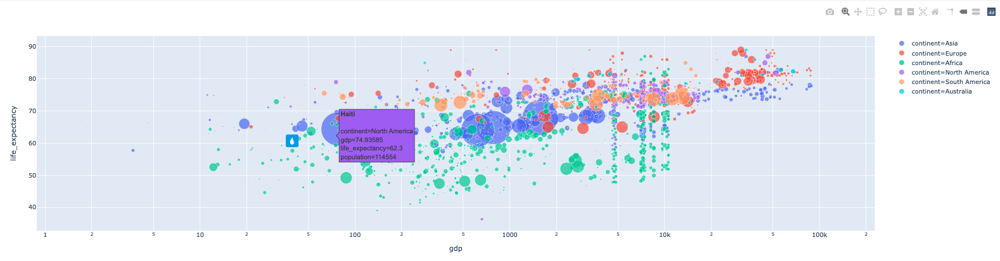

# Analyzing the impact of vaccination on human lifespans in developed and developing nations
## Technologies and resources
- Python 3.6 
- Analysis libraries: numpy, pandas
- Visualization libraries: matplotlib, seaborn, plotly (interactive visualization), [pycountry](https://github.com/jefftune/pycountry-convert) (get continent name from country)
- Author: Wendy Ha
- The Life Expectancy (WHO) dataset: https://www.kaggle.com/datasets/kumarajarshi/life-expectancy-who
- Notebook with details coding: https://colab.research.google.com/drive/1_y5MCmAptpWYK-XxzziXwRSCJXfWTyX3?usp=sharing
## Introduction
Despite the fact that many research have been conducted in the past on factors impacting life expectancy, including demographic characteristics, income composition, and mortality rates, Max Roser emphasized on Our World In Data that the influence of vaccines has been overlooked (Max et al 2013)
<br/>
<br/>
Share the same concern with Max, two researchers from World Health Organization (WHO) Department of Data and Analytics, Deeksha Russell and Duan Wang, have compiled a collection of statistics on the key drivers of life expectancy, with a focus on immunization variables including Hepatitis B, Measles, Polio, and Diphtheria (Deeksha and Duan 2015). Furthermore, mortality, economy, social issues, and other health- related aspects are all taken into consideration (Deeksha and Duan 2015). As a result, numerous analyses of the impact of vaccination on human lifespans in developed and developing nations have been undertaken using this data set, with the goal of assisting residents in those countries in improving their quality of life.
### Objective
The analysis tries to answer the following essential questions:
- Among four main categories: vaccination-related factors, mortality-related factors, economic factors, and social factors, what are the actual factors
influencing life expectancy?
- What effect does immunisation coverage have on life expectancy?
- What effect do schooling and alcohol have on life expectancy?
- What effect does GDP have on life expectancy?
## Data Cleaning Process
### Detecting and Handling missing values
- **Detecting missing values**


- **Dealing with Missing values**

Using the mean (average) value of the year to replace missing values.
```ruby
imputed_data = []
for year in list(df.year.unique()):
    year_data = df[df.year == year].copy()
    for col in list(year_data.columns)[3:]:
        year_data[col] = year_data[col].fillna(year_data[col].dropna().mean()).copy()
    imputed_data.append(year_data)
df = pd.concat(imputed_data).copy()
```

### Detecting and Handling outliers
- **Checking Data Distribution with Histogram and Box Plots**




- **Retrieving outliers’ data with IQR score**
```ruby
def outlier_count(col, data=df):
    print(15*'-' + col + 15*'-')
    q75, q25 = np.percentile(data[col], [75, 25])
    iqr = q75 - q25
    min_val = q25 - (iqr*1.5)
    max_val = q75 + (iqr*1.5)
    outlier_count = len(np.where((data[col] > max_val) | (data[col] < min_val))[0])
    outlier_percent = round(outlier_count/len(data[col])*100, 2)
    print('Number of outliers: {}'.format(outlier_count))
    print('Percent of data that is outlier: {}%'.format(outlier_percent))
```
- **Dealing with outliers**

The Winsorizing approach proposed by Tukey & McLaughlin (1963) is suggested in this project to handle the outliers. An ideal approach is setting all outliers to a specific percentage of the data, for example, all data above the 95th percentile are recoded to the 95th percentile value, and all observations below the 5th percentile are recoded to 25th percentile value (Tukey & McLaughlin 1963).
```ruby
def test_wins(col, lower_limit=0, upper_limit=0, show_plot=True):
    wins_data = winsorize(df[col], limits=(lower_limit, upper_limit))
    wins_dict[col] = wins_data
    if show_plot == True:
        plt.figure(figsize=(15,5))
        plt.subplot(121)
        plt.boxplot(df[col])
        plt.title('original {}'.format(col))
        plt.subplot(122)
        plt.boxplot(wins_data)
        plt.title('wins=({},{}) {}'.format(lower_limit, upper_limit, col))
        plt.show()
```

## Data Visualization
### Question 1: What are the actual factors influencing life expectancy?

### Question 2: What effect does immunisation coverage have on life expectancy in two groups developing and developed countries?

### Question 3: What effect does Schooling and Alcohol have on Life Expectancy?

### Question 4: What effect does GDP have on life expectancy?

## Conclusion
1. The World Health Organization's data set on variables impacting life expectancy still has a lot of missing numbers. These missing data values are primarily seen in nations with small populations, where data sources are not abundant.
2. This dataset also contains numerous outliers that have been reprocessed using the Winsorization approach.
3. Many developing countries are doing a good job of promoting vaccination against hepatitis B, polio, and diphtheria among 1-year-old children in order to improve the life expectancy of their citizens. However, the availability of the measles vaccine still needs to improve because they is one of the most dangerous causes of the recent life expectancy declines.
4. One of the diseases that has a substantial influence on life expectancy in underdeveloped countries is HIV/AIDS. This directly highlights the important role of education in resolving this issue. If the number of people in developing countries who go to school increases, so does the number of HIV/AIDS infections and the mortality rate by HIV/AIDS will reduced. As a result, life expectancy possibly rises.
5. Furthermore, Alcohol intake is a severe problem in industrialised countries, with a detrimental influence on life expectancy. When the amount of alcohol consumed gets out of control (Centers for Disease Control and Prevention 2015), it has a negative impact on health, which in turn is a decrease in life expectancy.
